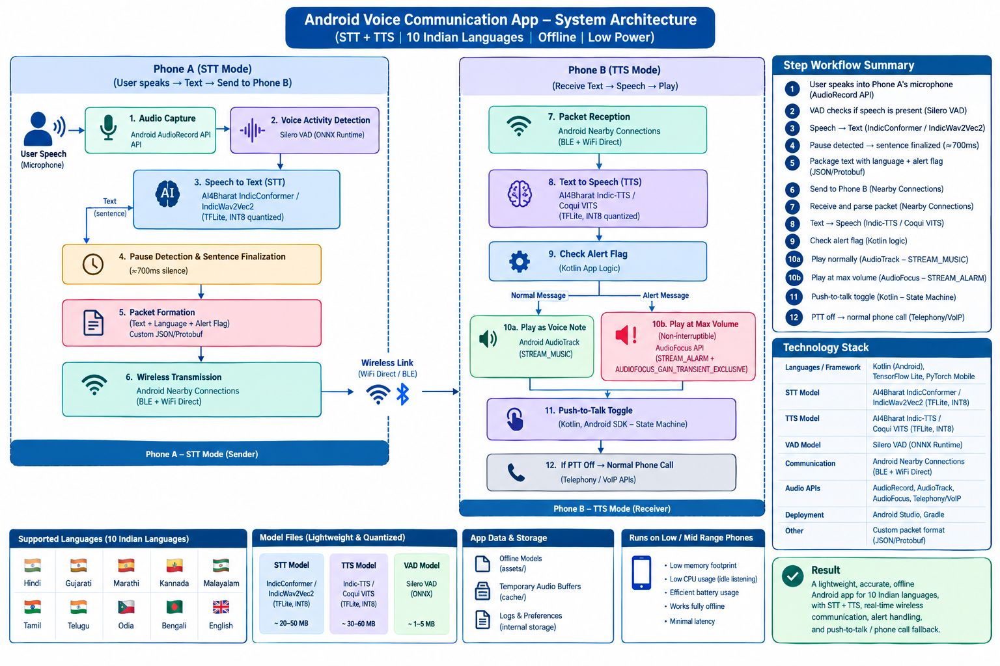
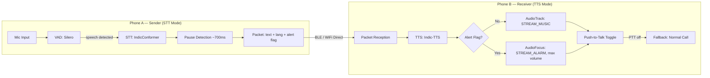
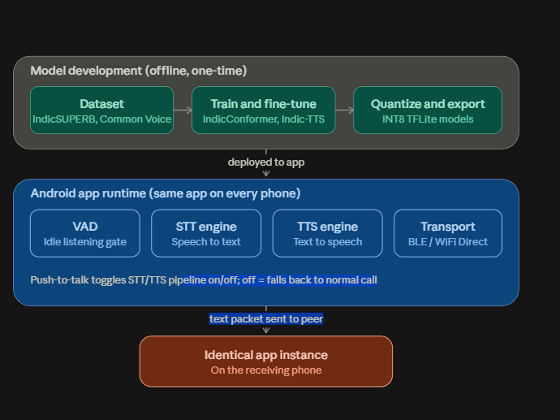
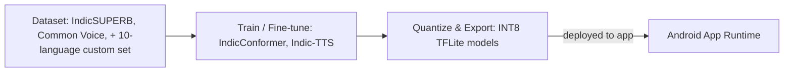
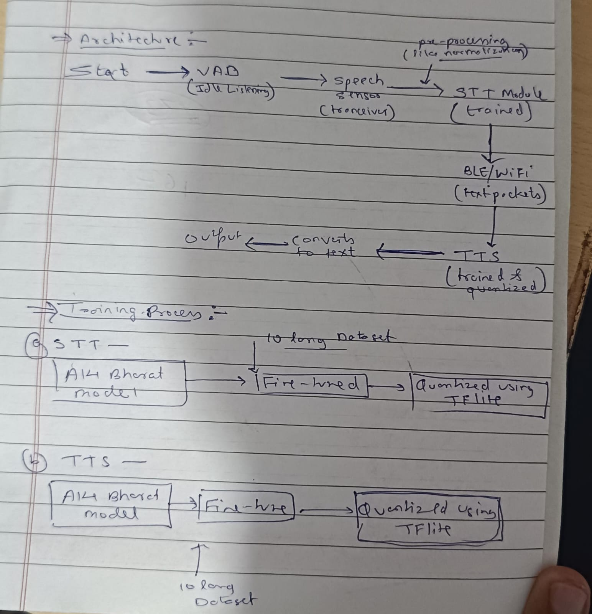
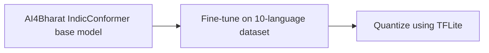
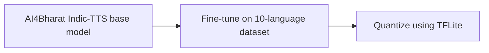
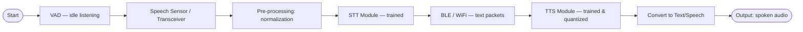

# System Architecture — iTantra

This document consolidates three views of the same system:

1. **Full end-to-end runtime architecture** (Phone A → Phone B, step by step)
2. **Model development pipeline** (how the on-device models are built, before deployment)
3. **Core concept flow** (the original whiteboard-level idea)

All three are provided as images in [`/diagrams`](../diagrams) — this document explains and formalizes them.

---

## 1. Full System Architecture (Runtime)

### 1.1 Phone A — Sender (STT Mode)

| Step | Component | Technology |
|---|---|---|
| 1 | Audio Capture | Android `AudioRecord` API |
| 2 | Voice Activity Detection | Silero VAD (ONNX Runtime) — filters silence, only passes real speech onward |
| 3 | Speech-to-Text | AI4Bharat IndicConformer (TFLite, INT8 quantized) |
| 4 | Pause Detection & Sentence Finalization | ~700ms silence threshold triggers sentence boundary |
| 5 | Packet Formation | Text + language tag + alert flag, packed as JSON/Protobuf |
| 6 | Wireless Transmission | Android Nearby Connections (BLE + WiFi Direct) |

### 1.2 Phone B — Receiver (TTS Mode)

| Step | Component | Technology |
|---|---|---|
| 7 | Packet Reception | Android Nearby Connections (BLE + WiFi Direct) |
| 8 | Text-to-Speech | AI4Bharat Indic-TTS (TFLite, INT8 quantized) |
| 9 | Alert Flag Check | Kotlin app logic — branches into normal vs. alert playback |
| 10a | Normal Playback | `AudioTrack`, `STREAM_MUSIC` |
| 10b | Alert Playback | `AudioFocus` API, `STREAM_ALARM` + `AUDIOFOCUS_GAIN_TRANSIENT_EXCLUSIVE` (max volume, non-interruptible) |
| 11 | Push-to-Talk Toggle | Kotlin state machine |
| 12 | PTT Off → Fallback | Normal phone call via Telephony/VoIP APIs |

### 1.3 Mermaid View

---

## 2. Model Development Pipeline (Offline, One-Time)

This is **built once, before the app ships** — it is not part of the real-time runtime loop.

| Stage | What Happens |
|---|---|
| **Dataset** | Public Indic speech corpora (IndicSUPERB, Mozilla Common Voice) + a curated 10-language dataset matching the exact target languages |
| **Train / Fine-tune** | AI4Bharat's base IndicConformer (STT) and Indic-TTS (TTS) checkpoints are fine-tuned on the target-language dataset |
| **Quantize & Export** | Fine-tuned models converted to INT8 TFLite format — this is what actually ships inside the APK |
| **Deploy** | Quantized `.tflite` files bundled into `assets/` folder of the Android app |

### 2.1 Per-Model Training Detail (from original concept notes)

**STT training branch:**

**TTS training branch:**

---

## 3. Core Concept Flow (Simplified)

This is the minimal mental model of what the system does, end to end:

---

## 4. Why This Architecture Satisfies the PS Constraints

| PS Requirement | How This Architecture Meets It |
|---|---|
| Fully offline | All inference (VAD, STT, TTS) runs on-device via TFLite/ONNX — zero network calls |
| Open-source only | Silero VAD, AI4Bharat models, TFLite, Android Nearby Connections — all open-source |
| Low/mid-range hardware | INT8 quantization shrinks models ~4x and speeds inference 2–3x; NNAPI delegate offloads to DSP/NPU where available |
| Low latency | VAD gates the pipeline (STT only runs on real speech) + streaming pause-detection (~700ms) minimizes end-to-end delay |
| Alert handling | Alert flag in the packet schema routes playback through `STREAM_ALARM` + exclusive `AudioFocus`, guaranteeing non-interruptible, max-volume playback |
| Walkie-talkie / fallback | State machine cleanly separates PTT-on (STT/TTS pipeline) from PTT-off (normal Telephony/VoIP call) |
