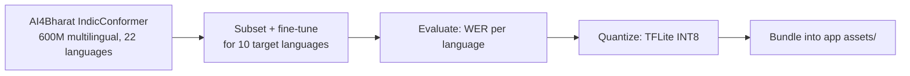
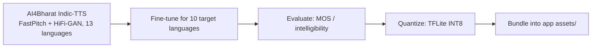

# Training & Quantization Pipeline

This is a one-time, offline process — its output (quantized `.tflite` files) is what ships inside the Android app. This pipeline itself does **not** run on the user's phone.

## STT Pipeline

**Base model:** `ai4bharat/indic-conformer-600m-multilingual` — a hybrid CTC + RNNT Conformer ASR model covering all 22 scheduled Indian languages, released under MIT license (Hugging Face: 2.07k+ likes, 399k+ downloads/month at time of writing).

**Fine-tuning rationale:** The base model already covers all 10 required languages (Hindi, Gujarati, Marathi, Kannada, Malayalam, Tamil, Telugu, Odia, Bengali; English is separately well-supported). Fine-tuning narrows the model to just these 10 languages and the expected vocabulary domain (alerts, distress phrases, common conversational speech), which both improves accuracy and allows a smaller exported model.

**Quantization:** Post-training INT8 quantization via TensorFlow Lite converter, following the integer-arithmetic-only inference scheme (Jacob et al., 2018) — reduces model size ~4x and roughly doubles-to-triples CPU inference speed, which is essential for low/mid-range phones.

## TTS Pipeline

**Base model:** AI4Bharat's Indic-TTS (ICASSP 2023), built on a FastPitch acoustic model + HiFi-GAN V1 vocoder, trained jointly on male and female speakers across Dravidian and Indo-Aryan languages.

**Why this architecture:** FastPitch + HiFi-GAN is a well-established combination for producing natural, low-latency speech synthesis suitable for real-time mobile use (as opposed to heavier autoregressive TTS models like Tacotron2, which are slower and harder to quantize for mobile).

## VAD (No Training Required)

Silero VAD is used as-is (pretrained, ONNX export) — it is language-agnostic and detects presence/absence of speech, not linguistic content, so no fine-tuning on Indian languages is necessary. Its role is purely to gate the STT pipeline so inference only runs when actual speech is present (this is what keeps idle-listening CPU usage near zero, satisfying the Efficiency metric).

## Dataset Sources

| Dataset | Use |
|---|---|
| IndicSUPERB | Benchmark + fine-tuning data across Indic languages |
| Mozilla Common Voice | Additional multilingual speech data, especially for English |
| Custom 10-language recorded set | Domain-specific vocabulary (alert phrases, distress terms, common conversational sentences) — improves real-world accuracy for the exact use case |

## Summary Table

| Model | Base | Fine-tuned For | Export Format | Approx. Size (post-quantization) |
|---|---|---|---|---|
| STT | AI4Bharat IndicConformer | 10 target languages | TFLite INT8 | ~20–50 MB |
| TTS | AI4Bharat Indic-TTS | 10 target languages | TFLite INT8 | ~30–60 MB |
| VAD | Silero VAD | (pretrained, no fine-tuning needed) | ONNX | ~1–5 MB |
